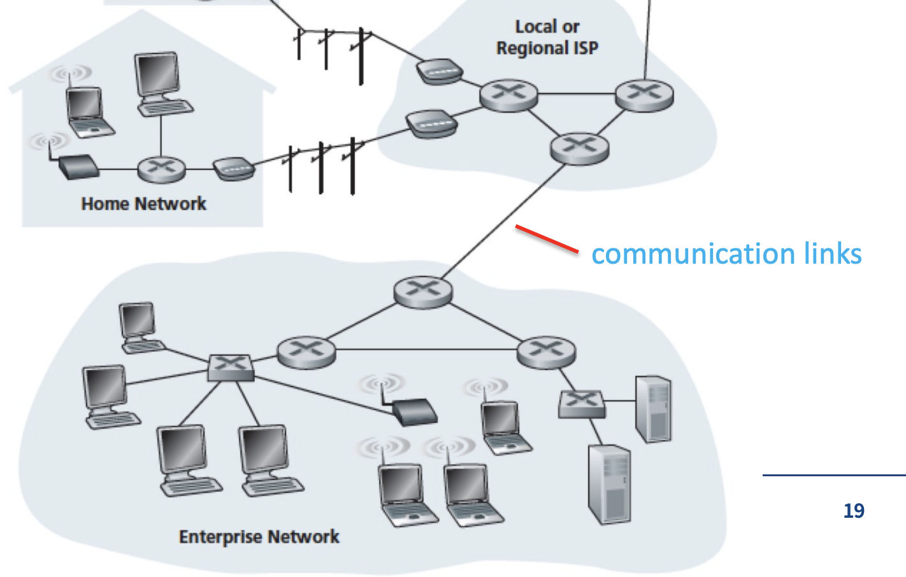

## Lecture1
- Internet
  - a computer network that connect billions of computers and some devices throughout the world
  - devices -> end systems, hosts
  - end system are connected  by  **communication link** 
  - some devices are packet switches (routers, link-layer switches)
  - **protocol** is the rule that control the sending and receiving of packets, it defines the format and the order of messages exchange.
    
  - **Layers** are organize protocols, each layer offers its services to the layer directly above it by
    - performing certain actions itself
    - use the services that provided by the layer directly blow it.
    - pros
      - provide a structural abstraction
      - only focusing on their own jobs
    - cons
      - introduces overheads
      - inefficient and has delays
      - increases the chance of making errors
## Lecture 2
- TCP/IP model (5 layers)
  - five layers in total
  - <u>Application layer</u>
    - network applications and application-layer protocols lives in.
    - Main protocols
      - HTTP
      - SMTP for email
      - FTP
    - protocols define
      - type of message exchanged
      - syntax of the various message types
      - semantics of the fields
      - ==what does these protocols means? (P.20)==
    - The protocol of this layer is distributed over multiple end systems, which can be used to *exchange packets of information* between different end system.
  - <u>Transport Layer</u>
    - provides a reliable byte stream between two nodes on a network, also in charge of congestion control and flow control
    - two main protocols
      - piece the packet into segments and add TCP or UDP header.
      - TCP (Transmission Control Protocol)
        - connection-oriented service
        - reliable
        - e.g. like a phone call, need two side to be involved.
      - UDP (User Datagram Protocol)
        - connectionless service
        - unreliable
        - e.g. publishing something to LED board that does not need responds.
  - <u>Network Layer</u>
    - provides network addressing (using MAC address) and routing (using IP address).
    - find a best way from source to destination.
    - IP protocol
      - the field in the packet
      - how the end systems and routers act on these fields
      - all network layer runs on IP protocol
    - Routing protocol
      - determine a series of routes that packets take between sources and destination
  - <u>Link layer</u>
    - pack data segments into frames
    - focusing on transform data from one node to another node.
    - protocol to chose depends on how the two node are connected
      - Ethernet
      - WIFI
    - link dependent
  - <u>Physical layer</u>
    - in charge of transform the byte stream into electrical signal and pulse depends on the media.  
  - <u>transport layer, application layer</u> are end-to-end, which means they don’t care about how the information has delivered. They only focus on the source and destination.
  - Notice that <u>network layer</u> is a **mix** of end-to-end and point-to-point. From the IP address perspective, it is from one IP to another, thus, it is a n end-to-end. From routing perspective, it has to decide transfer from which route to which node, thus, it is point-to-point.
  - <u>Link and Physical</u> are point to point, since they are link dependent. For example, using WIFI will use the different protocol comparing with using Ethernet.
- OSI Model (7 Layers)
  - Extra two layers directly under Application layer
  - <u>Presentation layer</u>
    - focusing on interpreting the meaning of data exchanged
      - compression
      - encryption
      - description
    - make the application layer care less about the data form
  - <u>Session layer</u>
    - build checkpoint and do the recovery scheme
- TCP/IP v.s. OSI
  - the extra two layers can be also implemented in application layer if the developer thinks they are important
- Socket
  - An API that transport layer provides to application layer
- HTTP
  - need a client program and a server program
  - <u>Web page</u>
    - document consisting of objects
  - <u>Object</u>
    - a file that is addressable by URL, such as a image
  - <u>URL (Uniform Resource Locator)</u>
    - hostname
    - path name
      
  - <u>Web browsers</u> are at client side, <u>web servers</u> are at server side.
  - **TCP** is the transport protocol for HTTP
    - Non-persistent connections
      - each request/response is sent over a separate TCP connection
      - For each object, it requires a request time + file transmission time
      - memory consuming
        -  since the TCP variable must be kept in buffer during the transmission
      - browser often open <u>parallel</u> TCP connections to fetch referenced objects.
    - Persistent connections (default option for HTTP)
      - All the requests and their responses are sent over the same TCP connection.
      - Server leaves connection open after sending response. The connection closes if it is not used for a certain time.
      - sending subsequent HTTP message for the same client/server pair will use this open connection
      - client can send requests at anytime without need to wait the pending requests (**pipelining**)
    - example are refer to the lecture slides
  - HTTP Request Message
    - Format and info
      - Host
      - User-agent
      - Connection
      - Accept-language
    - different method
    - different response code
  - HTTP Response Message
    - Format and info
      - Connection
      - <u>Date</u> of today with time
      - <u>Server</u> type
      - <u>Last-modified</u> date
      - Connection-length and type
  - Cookies
    - For allowing Web servers to identify users

reference:
1. [或许这样能帮你了解 OSI 七层模型 - 掘金](https://juejin.im/post/59eb06b1f265da430f313c7f)
2. [深入理解TCP/IP模型 - 知乎](https://zhuanlan.zhihu.com/p/33797520?utm_source=wechat_session&utm_medium=social&utm_oi=552206198036799488)