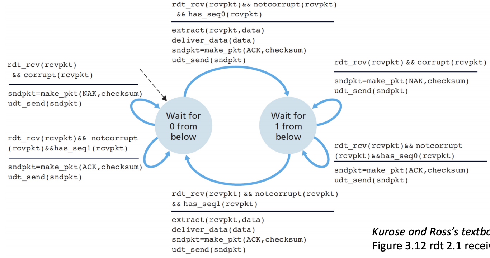
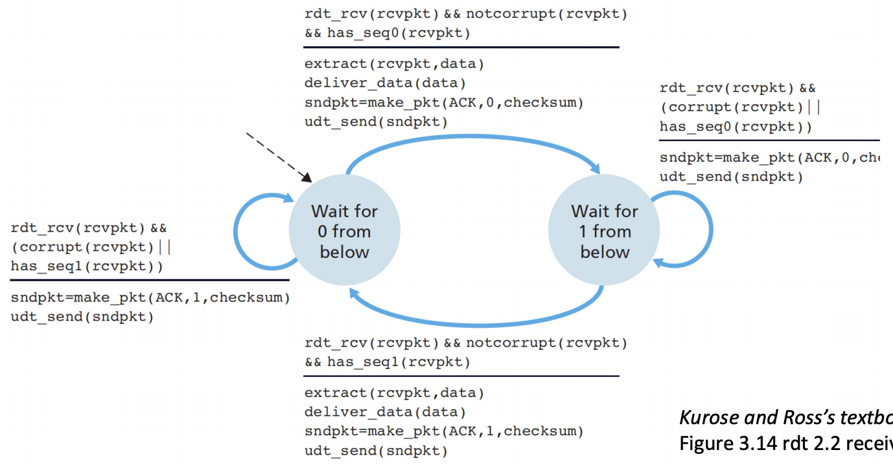
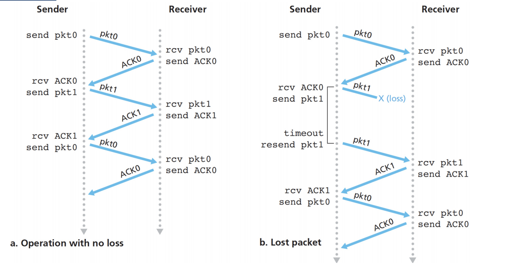

## Lecture 4

### RDT 2.1

-  sender
  - 

- reciver
  - 

### RDT 2.2

- Instead of sending NAK packets, we can simply sends an ACK packet for the last correctly received packet
- If the last received file has sequence number of 1
  - In RDT 2.1, it needs to send a NAK packet
  - IN RDT 2.2, it sends a ACK packet indicating 1
- sender
  - 
- receiver
  - 

### RDT 3.0

- The underlying channel can lost packets as well

- How to detect packet lost?

  - Timers can help, if timeout, we just start the retransmission.

- What to do?

  - The techniques of RDT 2.2 can handle the job
  - Retransmission is a panacea

- Sequence diagram

  - 

  - Replies multiple times

    

- However, this is not a good choice for practice

  - Since when the distance is long between two host, the waiting time will be really long.

### Pipelined RDT Protocols

- Send multiple packets without waiting for acknowledgements
  -  1-bit sequence is no longer sufficient, it needs <u>unique sequence number</u>
  - <u>Buffer</u> now is important to keep the keep the transmitted but not yet acknowledged.
- TCP
  - Coneection-oriented
    - Handshake is needed
  - Buffers and variable
    - To keep info during three-way handshake
  - Full-duplex
    - Both the two sides can send <u>a stream of data</u> to each other (mutual communication)
  - Grab data chunks from the send buffer, creates TCP segments and passes the segments to the network layer.