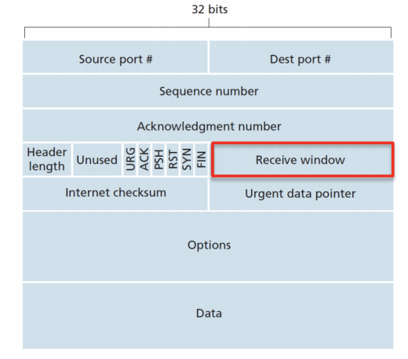
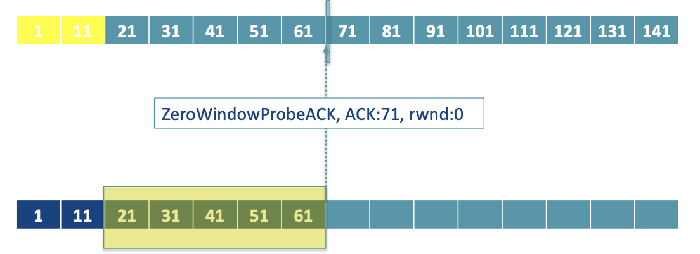
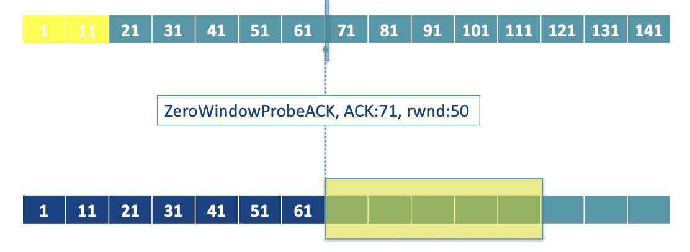
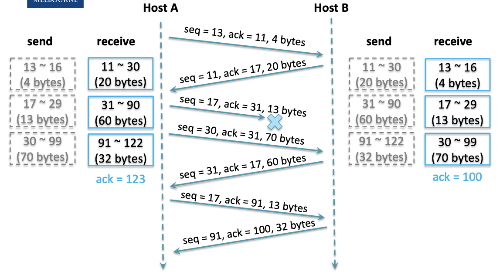

### Timer

- There is **only one** timer in sender
- Simplified procedure
  - Data received from application layer
    - Create a TCP segment
    - Start a timer, if timer is not running
  - timeout
    - Retransmit oldest not-yet-acknowledge segment
    - Start timer
  - When received a ACK, if there are any not-yet one
    - Restart timer again
  - Problems
    - The timeout period can be relatively long, delay resending the lost packet, thereby increasing the end-to-end delay.
  - Solution
    - Fast Retransmission
      - Count duplicate ACK received for a segment with sequence number y
      - Increase the duplicate ACK counter of segment y by 1
      - If this counter reaches to 3 (means we have 3 duplications but actually we received 4 of ACK with same number)
        - Resend the segment y before the timeout
        - Reset the counter of segment y to 0
      - Why 3?
        - Sometimes receiver are out of order, but when it reach to 3, it is very likely that the packet is lost.

### TCP Flow Control

- To eliminate the possibility of the sender overflowing the receiver's buffer

  - Let the sender know how much **free buffer space** is available at the receiver.

  - 16 bits number in header

    

- Sliding Window

  - Out of order segment could be dropped at any time if necessary, therefore, when we response the rwnd size, we don't consider the out-of-order sequence.

- Deadlock
  - Once the rcwd becomes 0, the sender won't send and receiver won't receive.

    - Sender starts persist timer, periodically send **ZeroWindowProbe** segments.

    - The receiver will response to the **ZeroWindowProbe** segments with valid number of rwnd

      - No space

        

      - Some space

        

      - Once there are enough buffer, the process will back to normal

        

### A TCP error handling exercise

- Exercise about communication and handle missing

  - 

  - When receiving a sequence, the last bit is the first byte + length - 1 (13+4-1)

  - But the ACK is simply the first byte + length (13+4 = 17), which is the first missing byte

    

### Congestion Control

- Definition
  - The sender needs to control its send rate according to the congestion state of the network
  - Maximum Segment Size(MSS)
    - The maximum allowable size of the data field in a segment
  - Round-trip Time (RTT)
    - The time that a segment is sent to the receiver and its ACK is sent back to the sender.
  - Transmission Round
    - All the segments in the congestion window are sent out to the receiver and their ACK's are sent back to the sender.
      - In pipeline transmission, we can assume RTT = Transmission Round
- Questions
  - How does the sender control its traffic send rate?
    - Maintance a congestion window cwnd
    - LastByteSent - LastByteACKED $\leq$ min(cwnd, rwnd)
  - How does the sender perceive the network congestion?
    - Segment loss
      - Time out
      - Fast retransmission
  - What algorithm should the sender use to perform congestion control?
    - Slow start
      - Set cwnd = 1MSS
      - For each transmission round:
        - For each ACK for a not-yet-acknowledged segment:
          - cwnd = cwnd + 1 MSS
          - Which is double the cwnd in each round
        - If cwnd reach the threshold
          - run the <u>Congestion Avoidance</u> algorithms
        - If a timeout event occurs:
          - ssthresh = cwnd / 2
          - cwnd = 1MSS
        - If a fast transmission event occurs:
        - ssthresh = cwnd / 2
        - Cwnd = ssthresh +3 MSS (since at least 3 segments will be successfully sent)
        - Run fast recovery
    - Congestion avoidance
      - 
    - Fast recovery