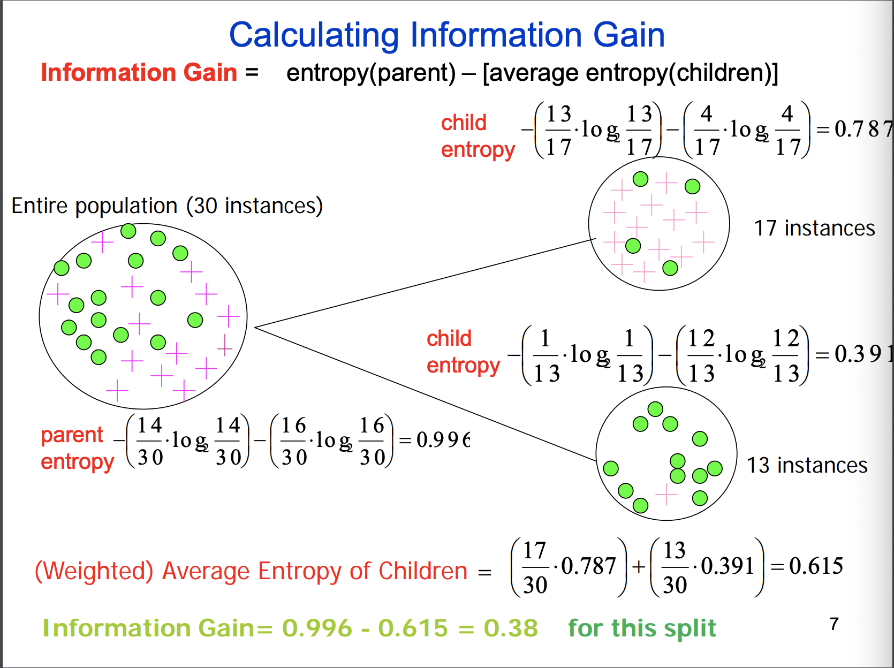

## Lecture 1
Some Very basic probability

### Entropy

- A measure of unpredictability
- H(X) = $-\sum_{i=1}^{n}P(x_i)log_2P(x_i)$, where we define $0\log_20=0$
- The range of the entropy value is **not** [0,1]
- $0 \leq Entropy \leq log(n)$, where n is the number of outcomes
  - 0 is a single event with probability 1, others are 0
  - log(n) uniform probability distribution which is each has $\frac{1}{n}$ 

### IG (information gain)

- Parent entropy - weighted child entropy

  

### Model

- abstract representation of data

- probability model 
  - we normally don’t know the probability so we have to estimate based on the incoming informations

## Lecture 2 
### Naive Bayes 

- supervised machine learning algorithms
- Based on the bayes rule, for a given instance X with features x^I^ (I = 1…n)
  - We want
    -  $argmaxP(Y=c_k|X=x^i)$ 
  - Now we have
    -  $P(Y=c_k|X_1=x_1, X_2=x_2…)$ 
  - Based on bayes rule
    -  $P(Y=c_k|X_1=x_1, X_2=x_2…)=\frac{P(X_1=x_1,X_2=x_2…|Y=c_k) P(Y=c_k)}{P(X_1=x_1,X_2=x_2…)}​$ 
  - since the denominator won't affect our result (since we only care who is the largest one), we can simply ignore that, then the equation becomes
    - $P(Y=c_k|X_1=x_1, X_2=x_2…) \propto P(X_1=x_1,X_2=x_2…|Y=c_k) P(Y=c_k)​$ 
  - And we make a huge assumption here, which is all of the features are independent. In this way, we might somehow lose some precision rate, but we reduce the complexity of the problem dramatically. It may cause some big problems in the following conditions:
    - The features are connected really closely, therefore, the premise for NB does not exist.
    - ==Needs more== 
    - $P(X_1=x_1,X_2=x_2…|Y=c_k) P(Y=c_k) = P(Y=c_k)P(X_1=x_1|Y=c_k)P(X_2=x_2|Y=c_k)…$ 
  - $P(Y=c_k)$ can be estimated using MLE or Bayesian estimate
- Smoothing
  - <u>Why?</u>
    - If the incoming instance has a feature that we haven't seen in the training set, we might get a 0 probability as a bad result.
    - However, nothing is 100% impossible.
  - <u>How?</u> 
    - Epsilon ($\epsilon​$) smoothing
      - Replace all the 0 with a $\epsilon$ which is a number which greater than 0 but smaller than $\frac{1}{n}$ (preferably).
      - Assume $1+\epsilon \approx 1$
    - Laplace smoothing
      - $\hat{P}(X_i=x_i|Y=c_k) = \frac{\sum_i I(X_i=x_i,Y=c_k) + \lambda}{\sum I(Y=c_k) + n\lambda}​$ Where n is the number of different attributes
      - This equation comes from the combination of Beta(prior) and binomial(posterior) which use the idea of bayes estimation.
      - Normally we set $\lambda$ to 1, but it actually can be any number.
    - Other choice
      - Add-k smoothing: set $\lambda$ to any integer which larger than one.
      - Regression
      - Good-Turing estimation
    - Which one is better?
      - Normally Laplace may perform better, but overall it depends on the data.
- Missing value
  - In training set and testing set, just ignore it.
- Advantages
  - Very simple to build, and run extremely fast to make decisions
  - <u>Works well in many application areas</u>, since it does not have a hash restriction of the data type.
  - <u>Scales easily</u> for large number of dimensions and data size
  - Decent interpretability
  - No need of exactly value of $P(Y=c_k|X_i=x_i)​$, since we only care about which one is better.
  - Relative robust to two common type of errors:
    - Over-estimated some $P(Y=c_k|X_i=x_i)$, but we have under-estimated others. Overall, we tends to under-estimate overall probability.
    - Some marginally-relevant attributes are correlated ==that means we over-estimate our confidence, but the predicted class tends to be the same== (what does this mean exactly?)
- In practical
  - To prevent under-flow, we can use the log-transformation, which the final equation becomes
    - $argmaxP(Y=c_k)\prod_i P(X_i=x_i|Y=c_k) = argmax[log(P(Y=c_k)) + \sum_ilog(P(X_i=x_i|Y=c_k))]​$

